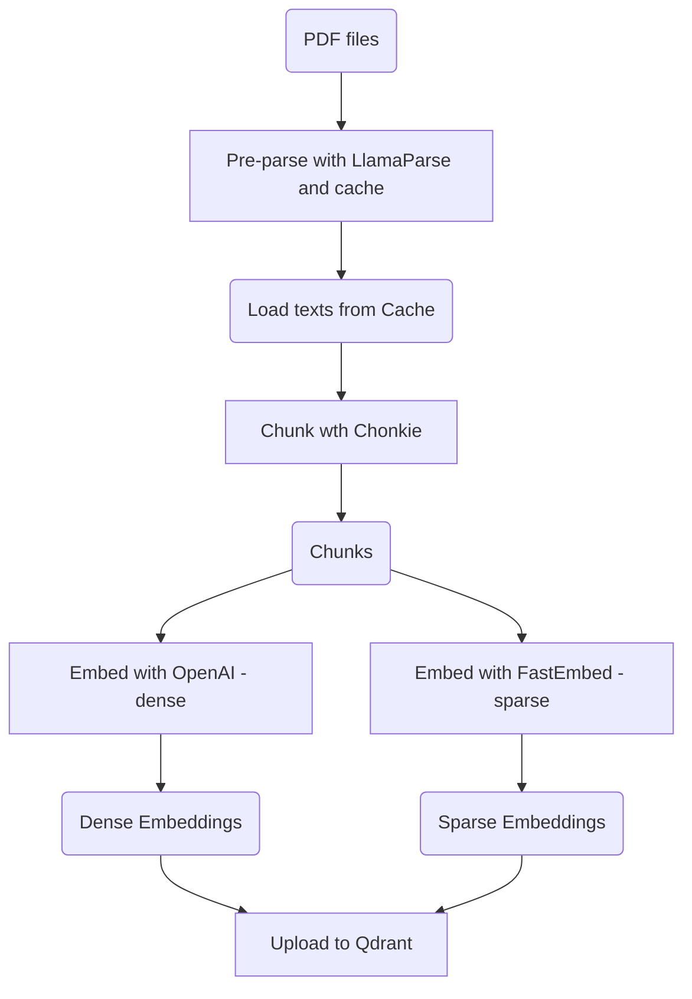
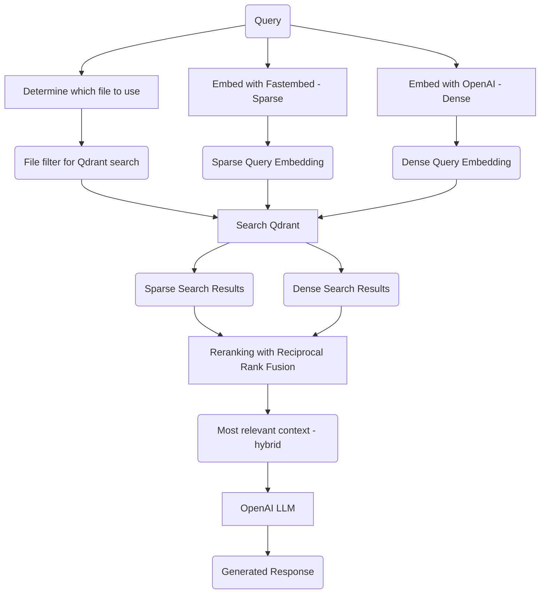

# rag-starterkit

RAG application built around a starter kit to benchmark in performance against the fs-explorer agent.

## Stack

- [LlamaParse](https://developers.llamaindex.ai/python/cloud/llamaparse/) for advanced, OCR-driven text parsing and extraction
- [Chonkie](https://chonkie.ai) for sentence-based chunking
- OpenAI for dense embeddings
- [FastEmbed](https://github.com/qdrant/fastembed) for sparse embeddings
- [Qdrant](https://qdrant.tech) for vector storage and search

## Flow

### Data Ingestion

### Retrieval Augmented Generation

